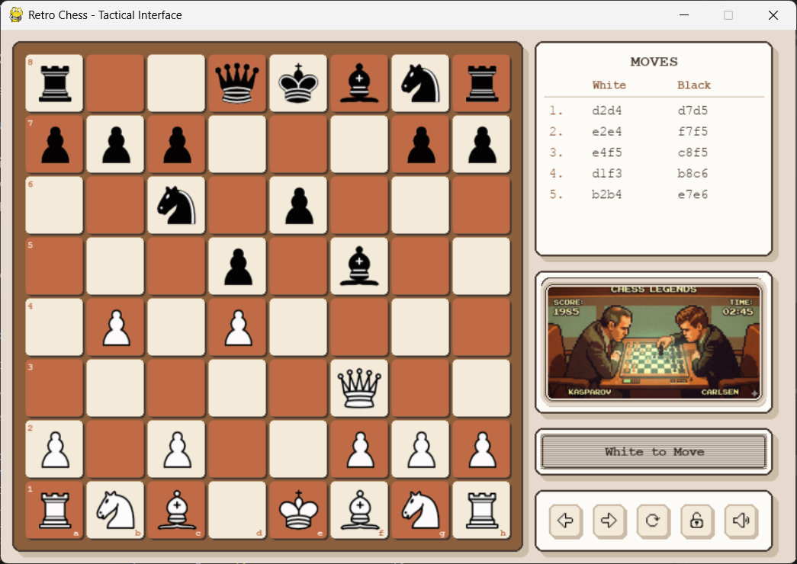

# Retro Chess Engine

We will dethrone chess.com, Insha'Allah.

## Description
A chess engine where two players can play against each other on the same board in a turn-based game, with a simple modern UI along with proper move validation and rule enforcement.

## Installation
Install RetroChess.exe for windows from the [Releases Page](https://github.com/SaqibMasoodi/ChessEngine/releases).

or
Clone the repository and install dependencies:

```bash
git clone https://github.com/SaqibMasoodi/ChessEngine.git
cd ChessEngine
pip install -r requirements.txt
```

## How to Play
Run the application:

```bash
python Chess/ChessMain.py
```

**Controls**:
- **Mouse / Touch:** Click to select, highlight valid targets, and move pieces.
- **Button Panel:** Located at the bottom right. Features pixelated icons for:
  - **Undo**: Reverts the last move (and restores captured pieces/castling rights).
  - **Redo**: Tracks alternate timeline moves unless a new divergent move is played.
  - **Reset**: Instantly resets the board securely without holding ghost states.
  - **Mute**: Toggles sound engine.
- **Keyboard Shortcut:** Press `Z` to rapidly Undo.

## Engine Explanation
Read the logic behind the engine in the [Engine Explanation](ENGINE_EXPLANATION.md).

## Credits
For a full breakdown of the assets, audio, and algorithmic resources used in this project, please refer to my [Credits](CREDITS.md) file.

---


